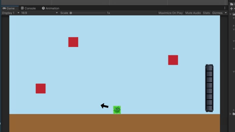
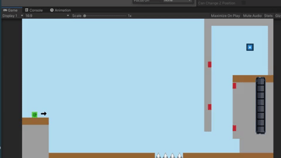

# Sticky

2D Sticky Jump Slime

<h2>Jump and Stick to objects</h2>

The direction of the jump is controlled by mouse position, pressing the left mouse click charges the jump, releasing the left mouse click makes the slime jump

<h2>Death and Respawn</h2>

Whenever the player hits something that will kill the slime, the slime is respawned. The position of the respawn will be a "default respawn location" set in the inspector, or, if available the last valid player position

<h2>Levels</h2>

Two simple levels, objective is to get to the blue portal to advance to next level. Red spots mark positions that can be "sticked" to. Also added a "Spawn Point" to specify where the player should spawn, if no spawnpoint is defined, default values are used instead.

